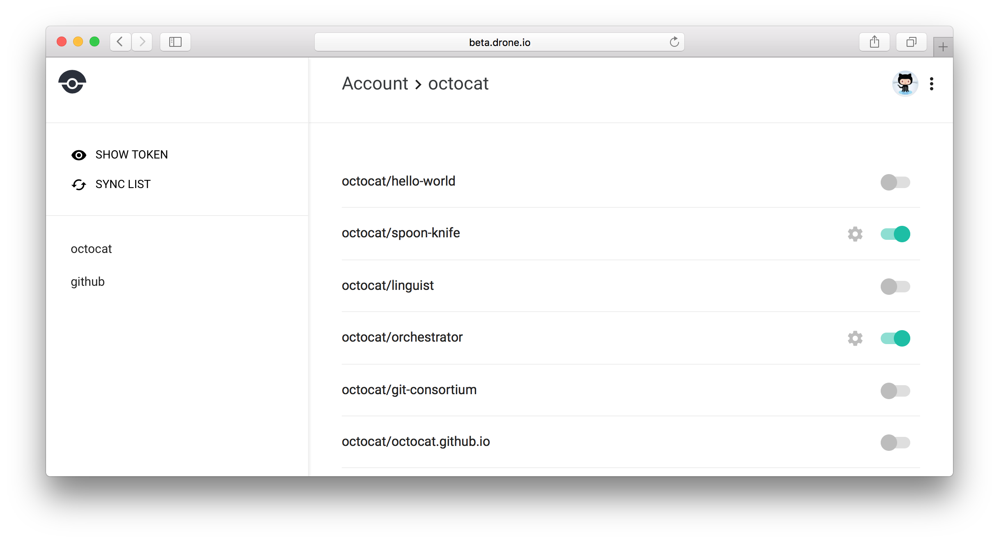

# MySQL
MySQL is a popular database server used by companies such as Wikipedia, Facebook and Google

## Usage
Your cloud provider may provide a MySQL database as a service (such as aws/rds), which may be preferred so that the database management is kept at a minimum. Hosting the database within the Critical Stack cluster, however, allows for all communications to the backend database to remain within the secured cluster environment by eliminating any external rules/proxies that would be required. The MySQL database will be deployed with a service listening to port 3306

### Requirements
MySQL does need a persistent volume if you would like for your database to retain records upon restarting.

